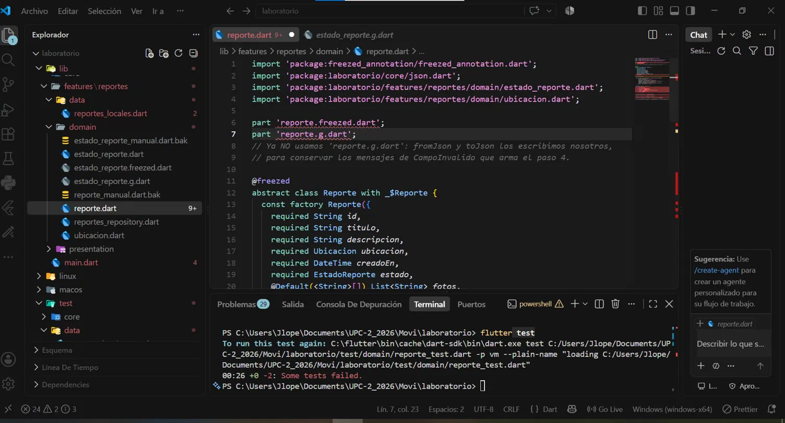

# laboratorio

A new Flutter project.

## Getting Started

This project is a starting point for a Flutter application.

A few resources to get you started if this is your first Flutter project:

- [Learn Flutter](https://docs.flutter.dev/get-started/learn-flutter)
- [Write your first Flutter app](https://docs.flutter.dev/get-started/codelab)
- [Flutter learning resources](https://docs.flutter.dev/reference/learning-resources)

For help getting started with Flutter development, view the
[online documentation](https://docs.flutter.dev/), which offers tutorials,
samples, guidance on mobile development, and a full API reference.

### Evidencia del problema encontrado

Al generar con freezed 4.0.0-dev.3, el archivo `reporte.g.dart` producía:

  'ubicacion': instance.ubicacion,   // sin convertir a Map
  'estado': instance.estado,

Esto causaba en las pruebas:
  type 'Ubicacion' is not a subtype of type 'Map<String, dynamic>' in type cast

  

 //////////////////////////
tengo errores en : reporte.freezed.dart

en _$ReporteToJson y   factory _Reporte.fromJson(Map<String, dynamic> json) => _$ReporteFromJson(json);

// GENERATED CODE - DO NOT MODIFY BY HAND
// coverage:ignore-file
// ignore_for_file: type=lint, type=warning, deprecated_member_use, deprecated_member_use_from_same_package
// ignore_for_file: unused_element, deprecated_member_use, deprecated_member_use_from_same_package, use_function_type_syntax_for_parameters, unnecessary_const, avoid_init_to_null, invalid_override_different_default_values_named, prefer_expression_function_bodies, annotate_overrides, invalid_annotation_target, unnecessary_question_mark
 
part of 'reporte.dart';
 
// **************************************************************************
// FreezedGenerator
// **************************************************************************
 
// GENERATED CODE - DO NOT MODIFY BY HAND
// dart format off
T _$identity<T>(T value) => value;
 
/// @nodoc
mixin _$Reporte {
 
 String get id; String get titulo; String get descripcion; Ubicacion get ubicacion; DateTime get creadoEn; EstadoReporte get estado; List<String> get fotos;
/// Create a copy of Reporte
/// with the given fields replaced by the non-null parameter values.
@JsonKey(includeFromJson: false, includeToJson: false)
@pragma('vm:prefer-inline')
$ReporteCopyWith<Reporte> get copyWith => _$ReporteCopyWithImpl<Reporte>(this as Reporte, _$identity);
 
  /// Serializes this Reporte to a JSON map.
  Map<String, dynamic> toJson();
 
 
@override
bool operator ==(Object other) {
  return identical(this, other) || (other.runtimeType == runtimeType&&other is Reporte&&(identical(other.id, id) || other.id == id)&&(identical(other.titulo, titulo) || other.titulo == titulo)&&(identical(other.descripcion, descripcion) || other.descripcion == descripcion)&&(identical(other.ubicacion, ubicacion) || other.ubicacion == ubicacion)&&(identical(other.creadoEn, creadoEn) || other.creadoEn == creadoEn)&&(identical(other.estado, estado) || other.estado == estado)&&const DeepCollectionEquality().equals(other.fotos, fotos));
}
 
@JsonKey(includeFromJson: false, includeToJson: false)
@override
int get hashCode => Object.hash(runtimeType,id,titulo,descripcion,ubicacion,creadoEn,estado,const DeepCollectionEquality().hash(fotos));
 
@override
String toString() {
  return 'Reporte(id: $id, titulo: $titulo, descripcion: $descripcion, ubicacion: $ubicacion, creadoEn: $creadoEn, estado: $estado, fotos: $fotos)';
}
 
 
}

